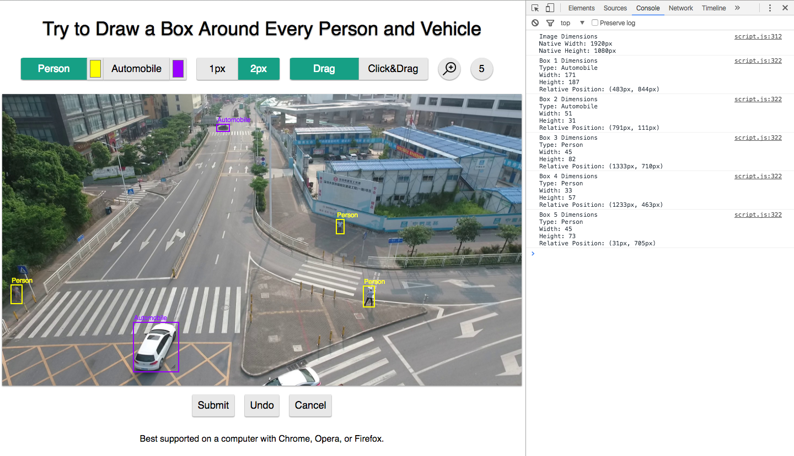

#AMT Drawbox

###Introduction
**AMT Drawbox** is a front-end UI application for drawing boxes on images. It also logs the dimensions and coordinates of the boxes, which can be reconfigured with server-side code to store such information on a database.

Drawbox is best used in conjunction with [Amazon Mechanical Turk][1], where you can pay workers to manually draw and submit the boxes for you. There are more details in the "Getting Started" section below.

###Getting Started
1. Clone or download this repository. Open up index.html to test if it works.
2. Replace the sample pictures in the "pictures" folder with the ones you need.
3. Make any necessary changes to the code (optional).
4. Hook this repository up with a server and some sever-side code.
5. Set it up on [Amazon Mechanical Turk][1] (optional).

###Jade and SCSS Files
This application was created using Jade and SCSS files preprocessed into HTML and CSS, respectively. If Jade and SCSS are not your thing, you can ignore those files and stick to the regular HTML and CSS files.

###Browser Compatibility
Drawbox is compatible with the latest versions of Firefox, Chrome, and Opera.

However, it uses the [color input type][2], which is not supported in most other browsers, most notably Safari <9 and Edge <13. It hasn't been tested in Internet Explorer, which probably has limited functionality.

The application is not meant to be used on touchscreen devices, so the site has not been tested on mobile devices yet. If mobile visitors are important for you, you can include mobile support yourself.

###Changelog
You can view the commits [here][3].

###Credits
This application was created by Jeffery Tang, with the help of people at the South University of Science and Technology of China. The following external libraries/code were used:
- [jQuery][4]
- [jQuery UI][5]
- [jQuery Color][6]
- [jQuery Easing][7]
- [Normalize.css][8]
- [Magnify][9]
- [Spencer Lockhart (Stackoverflow)][10]

[1]: https://www.mturk.com/mturk/welcome
[2]: http://caniuse.com/#search=color
[3]: https://github.com/projeffboy/amt-drawbox/commits/master
[4]: http://jquery.com/download/
[5]: http://jqueryui.com/download/
[6]: https://github.com/jquery/jquery-color/
[7]: http://gsgd.co.uk/sandbox/jquery/easing/
[8]: https://necolas.github.io/normalize.css/
[9]: https://github.com/thdoan/magnify
[10]: http://stackoverflow.com/questions/17408010/drawing-a-rectangle-using-click-mouse-move-and-click
